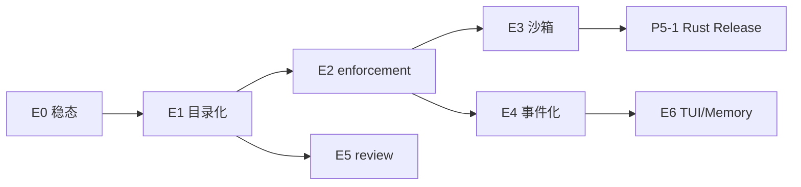

# Phase E — 向 Codex 学 Harness，守 Meris 差异化

> **状态**：规划（2026-05）  
> **宗旨检验**：[VISION.md](../VISION.md) — 同一项目里第二次做同类任务是否更省事？  
> **对照**：[OpenAI Codex CLI](https://github.com/openai/codex) · [Harness engineering](https://www.engineering.fyi/article/harness-engineering-leveraging-codex-in-an-agent-first-world)

---

## 1. 规划原则

### 学 Codex 什么

| 主题 | Codex 做法 | Meris 落地方式 |
|------|------------|----------------|
| Harness 结构 | AGENTS.md ≈ 目录，细节在 `docs/` | 减 system prompt 膨胀，按需 `read_file` / `load_skill` |
| 机械 enforcement | 架构/结构测试，失败信息给 Agent 自修 | 扩 `benchmark` + optional `meris harness check` |
| 安全 | OS 沙箱 + 策略与 loop 解耦 | 分阶段：`strict` 模式 → `meris-rs sandbox` |
| 工程 | Submission/Event 异步、exec 无头 | loop 事件化；`meris exec --json` |
| SDLC | 专用 review pass | `meris review`（只读第二 Agent） |

### 不学 / 低优先

- 绑死 OpenAI 模型 · Cloud Agent 全家桶 · Desktop 操控全 OS · 闭源 Memory 替代 Harness 文件

### Meris 必须守住的差异化

1. **多厂商 routing**（`profiles` / `rules` / `dynamic`）  
2. **Ratchet 可验证进化**（scan/analyze + digest/insights + benchmark gate）  
3. **Harness 在 Git**（rules/skills 可 PR、可 revert）  

---

## 2. 当前基线（Phase D 完成后）

| 已有 | 缺口（相对 Codex） |
|------|-------------------|
| Ratchet 被动 + digest 主动 | AGENTS 易膨胀；无架构级 mechanical check |
| permissions + blockedPaths | 无 OS 级沙箱 |
| Python loop + TUI + IDE 扩展 | 无 SQ/EQ 事件架构；无 review 模式 |
| meris-rs：context/permissions MVP | loop 仍在 Python；sandbox 未移植 |
| benchmark 7 任务（含 local harness_check） | 沙箱 / review 仍缺 |

**发布债**（可与 E 并行）：GitHub Release · PyPI `0.0.1` · `settings.local` 列表 merge 策略（见 [MODELS.md](MODELS.md) footgun）

---

## 3. Phase E 总览

建议 **12 周** 节奏（可压缩为 8 周，见 §8）。每阶段结束：**pytest 绿 + benchmark 绿 + dogfood 1 条 PROGRESS 记录**。

```
E0  稳态 + 发布准备          （1 周）
E1  Harness 目录化           （1～2 周）  ← 最先做，收益最大
E2  机械 enforcement        （2 周）
E3  沙箱 MVP                （2～3 周）  ← 与 meris-rs 联动
E4  Loop 事件化             （2 周）
E5  Review + Exec           （1～2 周）
E6  Memory UX + Ratchet TUI （2 周）     ← Meris 独有体验
```

依赖关系：



---

## 4. 分阶段任务与验收

### E0 — 稳态与发布准备（~1 周）

| # | 任务 | 验收 |
|---|------|------|
| E0.1 | 文档：`settings.local` 只写 ep/dynamic 写入 `USER_SETUP.md` | 新用户不再整段复制 byMode |
| E0.2 | `meris doctor` 检查 AGENTS/rules 总 token 估算（warn） | 过大时提示 E1 |
| E0.3 | Dogfood：`benchmark run` + `ratchet status` 进 CI 可选 job | CI 绿 |
| E0.4 | （可选）GitHub Release + PyPI 0.0.1 | 外部可 `pip install` |

**不做**：新功能堆叠。

---

### E1 — Harness 目录化（~1～2 周）★ 优先

**进度（已落地）**：E1.1 ✅ · E1.2 ✅ · E1.3 ✅ · E1.4 ✅ · E1.5 ✅ · E0.2 doctor warn ✅

**目标**：AGENTS.md 变「地图」，细节进 `docs/harness/`，减 prompt 噪声。

| # | 任务 | 验收 |
|---|------|------|
| E1.1 | 新增 `docs/harness/`：`architecture.md`、`testing.md`、`routing.md` | 从 AGENTS 迁出非必读段落 |
| E1.2 | 改 `load_guides()`：AGENTS 全文 + **rules 摘要**（或 frontmatter `inject: always`） | system prompt 字符数下降 ≥30%（Meris 仓库实测） |
| E1.3 | AGENTS 增加「深度文档索引」表 + `load_skill` 指引 | Agent 遇架构问题时读 `docs/harness/...` |
| E1.4 | 模板 `init-harness` 同步 | 新仓库默认目录结构 |
| E1.5 | benchmark 任务 `docs_smoke`：Agent 能否找到 DoD 文档 | benchmark 绿 |

**Codex 对照**：Harness 团队「AGENTS = table of contents, not encyclopedia」。

**Ratchet**：失败 → `L-docs-index` 规则提案（可选）。

---

### E2 — 机械 enforcement（~2 周）

**进度（已落地）**：E2.1 ✅ · E2.2 ✅ · E2.3 ✅ · E2.4 ✅ · E2.5 ✅

**目标**：不只靠 markdown 说教；失败信息可直接指导 Agent 自修。

| # | 任务 | 验收 |
|---|------|------|
| E2.1 | `meris harness check`（或 `benchmark` 子集）：路径/import/plan 格式 | 违规时 exit≠0 + 固定 hint 文案 |
| E2.2 | 扩 benchmark：`harness_paths_smoke`、`plan_smoke` 已有；加 `import_prefix_smoke` | 3→5+ 任务 |
| E2.3 | sensor 失败输出 **Ratchet 友好** detail（可触发 scan） | events.jsonl 可分类 |
| E2.4 | Ratchet classify：新 kind `harness_check_fail` → 提案 | scan 能出 pending |
| E2.5 | 文档：DoD = pytest + `meris harness check` | AGENTS DoD 更新 |

**Codex 对照**：custom linters + 结构测试，错误信息写给 Agent。

---

### E3 — 沙箱 MVP（~2～3 周）

**进度（已落地）**：E3.1 ✅ · E3.2 ✅ · E3.3 MVP ✅ · E3.4 文档 ✅ · E3.5 ✅（`MERIS_NATIVE=1` 时 permissions/sandbox/bash 走 meris-rs）

**目标**：bash 不再裸跑宿主机；策略与 loop 解耦（学 codex `execpolicy` / `linux-sandbox`）。

| # | 任务 | 验收 |
|---|------|------|
| E3.1 | settings：`sandbox.mode: off \| warn \| strict`（默认 `warn`） | doctor 显示当前模式 |
| E3.2 | `strict`：cwd 锁定 workspace；bash 超时；禁 `cd`/`find` 类（已有 rule 辅助） | 集成测试 |
| E3.3 | Linux/WSL：`meris-rs sandbox run -- cmd`（参考 codex-rs，bubblewrap 可选） | CI linux job |
| E3.4 | Windows：Job Object / 受限子进程（最小可行）或文档声明 WSL 推荐 | 文档 + 单测 mock |
| E3.5 | permissions 检查优先走 `meris-rs permissions check`（P5-1） | parity 测试无 drift |

**不做（E3 内）**：网络 MITM proxy（Codex 级，放 P5+）。

---

### E4 — Loop 事件化（~2 周）

**进度（已落地）**：E4.1 ✅ · E4.2 ✅ · E4.3 ✅ · E4.4 ✅

**目标**：UI/TUI/IDE 与 core 解耦，为长任务与 Ratchet 面板铺路。

| # | 任务 | 验收 |
|---|------|------|
| E4.1 | 定义 `Op` / `Event` 类型（submission：user、cancel；event：token、tool、done） | `meris/harness/protocol.py` |
| E4.2 | `agent_loop` 可选 `--event-stream jsonl` | 外部可消费 |
| E4.3 | TUI 消费 Event 流（先 read-only 日志） | TUI 不 block 长 tool |
| E4.4 | 文档：与 Codex SQ/EQ 对照 | PLAN_PHASE_E 链接 |

---

### E5 — Review + Exec（~1～2 周）

**进度（已落地）**：E5.1 ✅ · E5.2 ✅ · E5.3 ✅ · E5.4 ✅（local `review_smoke`）

**目标**：对标 Codex `review` 与 `codex exec`。

| # | 任务 | 验收 |
|---|------|------|
| E5.1 | `meris review [--staged]`：只读 Agent，输出 markdown review | 不写盘 |
| E5.2 | routing：`review` mode → `fast` profile（settings.byMode.review） | models 文档更新 |
| E5.3 | `meris exec "task" --json`：无 TUI，stdout JSON 结果 | CI 可脚本化 |
| E5.4 | benchmark 可选：`review_smoke`（对固定 diff 输出含 checklist） | 可选 integration |

---

### E6 — Memory UX + Ratchet TUI（~2 周）

**进度（已落地）**：E6.1 ✅ · E6.2 ✅ · E6.3 ✅ · E6.4 部分 ✅ · E6.5 ✅

**目标**：统一「用户偏好」体验；不抄 Codex 闭源 Memory，用 Harness 文件 + digest。

| # | 任务 | 验收 |
|---|------|------|
| E6.1 | `.meris/rules/user-prefs.md` 为唯一偏好入口（digest 已支持） | load_guides 注入 |
| E6.2 | `meris ratchet digest` 进 dogfood 文档（7 天表加一行） | DOGFOOD_7DAY 更新 |
| E6.3 | TUI：Ratchet 面板（pending proposals + insights） | [RATCHET_DESIGN §10 P2](RATCHET_DESIGN.md) |
| E6.4 | Ratchet P2 余项：AGENTS section patch · `--force-settings` 提案 | 设计 §10 勾选 |
| E6.5 | `settings merge`：rules 按 name 合并（修 local 覆盖坑） | 单测 + MODELS 文档 |

**Meris 独有**：digest → 用户确认 → apply → benchmark，Codex 无等价闭环。

---

## 5. 与现有路线并行

| 轨道 | 文档 | 与 E 关系 |
|------|------|-----------|
| Rust P5-1～P5-4 | [RUST_ROADMAP.md](RUST_ROADMAP.md) | E3 触发 P5-1 Release；P5-4 长期，不阻塞 E1/E2 |
| Ratchet P2 | [RATCHET_DESIGN.md](RATCHET_DESIGN.md) | 并入 E6 |
| 发布 | [ROADMAP.md](../ROADMAP.md) Next | E0 可选交付 |

**建议**：E1、E2 纯 Python，**不等待** Rust；E3 再拉 meris-rs。

---

## 6. 成功指标（每个 E 阶段）

| 指标 | 测量方式 |
|------|----------|
| 第二次任务更省事 | `meris benchmark run` pass rate 不降；新 task 覆盖真实踩坑 |
| Prompt 变瘦 | `build_system_prompt` 字符数；doctor warn |
| 进化可验证 | Ratchet apply 后同类 benchmark 由 fail→pass |
| 安全可感知 | `sandbox strict` 下恶意 bash 被拦；events 可统计 |
| 可分发 | （E0）PyPI 安装后 `doctor` + `benchmark` 可跑 |

---

## 7. 12 周日历（建议）

| 周 | 焦点 | 交付 |
|----|------|------|
| 1 | E0 + E1 启动 | docs/harness 骨架；AGENTS 瘦身 |
| 2 | E1 完成 | docs_smoke benchmark |
| 3～4 | E2 | harness check + 新 benchmark |
| 5～6 | E3 | sandbox warn/strict + rs parity |
| 7～8 | E4 | event jsonl + TUI 消费 |
| 9 | E5 | review + exec |
| 10～11 | E6 | Ratchet TUI + settings merge |
| 12 | 缓冲 | PyPI/Release · 文档 · dogfood 复盘 |

若 **8 周压缩**：合并 E4 与 E6 的 TUI 部分到 E5 之后一次 sprint；E3 只做 `warn/strict` 不做 Linux bubblewrap。

---

## 8. 立刻可做的 3 件事（本周）

1. **E1.1**：建 `docs/harness/README.md` 索引，从 AGENTS 迁出「仓库布局」「Plan 格式」细节。  
2. **E2.1 原型**：`scripts/harness-check.py` 或在 `meris harness check` 检查 `meris/` 前缀、`- [ ]` 样本。  
3. **Dogfood**：每天 1 次 `meris run --ratchet`，周末 `meris ratchet digest` + `insights review`。

---

## 9. 相关文档

- [VISION.md](../VISION.md)  
- [ROADMAP.md](../ROADMAP.md)  
- [RATCHET_30MIN.md](RATCHET_30MIN.md) · [DOGFOOD_7DAY.md](DOGFOOD_7DAY.md)  
- [RUST_ROADMAP.md](RUST_ROADMAP.md)  
- [MODELS.md](MODELS.md)
