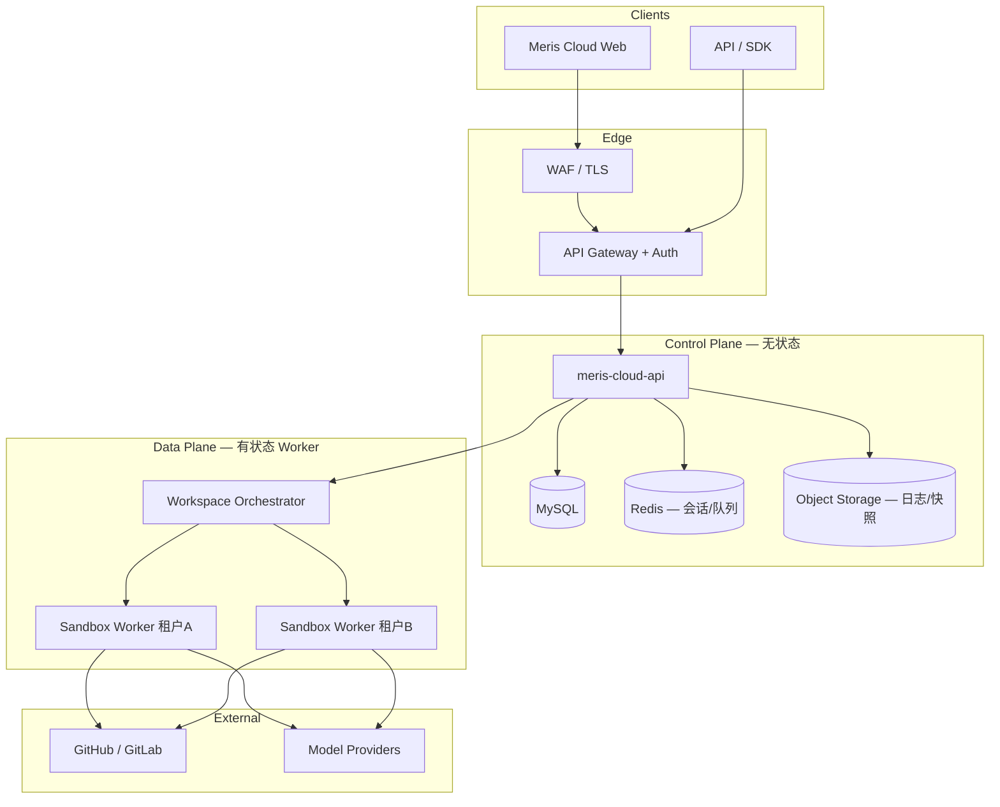
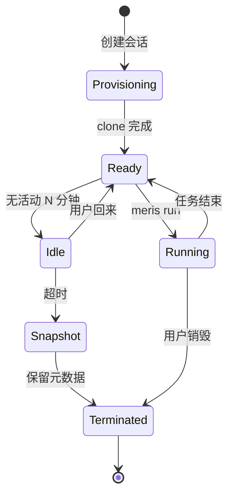

# Phase S — Meris 公网 SaaS（可写沙箱）

> **定位**：公网多租户 Coding Agent 服务。用户连接 Git 仓库，在**隔离沙箱**内完成 ask / plan / **run**（可写）、测试、git ship；Harness 进化仍写在项目 `.meris/`。
>
> **非目标**：把现有 `meris ui` 单进程直接暴露到 `0.0.0.0`（会串会话、串配置、无认证）。
>
> 配套 Harness 细节：[harness/saas-sandbox.md](harness/saas-sandbox.md) · 产品宗旨：[VISION.md](../VISION.md)

---

## 1. 设计原则

| 原则 | 含义 |
|------|------|
| **租户硬隔离** | 数据、配置、事件流、沙箱 FS 按 `tenant_id` 分界，默认互不可见 |
| **可写默认** | 首期即支持 `run` + bash + git write；不是「只读云助手」 |
| **Harness 进化在仓库** | Ratchet / rules / skills 落在用户仓库 `.meris/`，不塞进全局 prompt |
| **默认不 push** | UI 与 API 层 Commit 与 Push 分离；Push 需显式确认 + 审计 |
| **沙箱内二层防护** | 容器边界 + Meris 既有 `sandbox.preset` / seatbelt / network allowlist |
| **控制面无状态** | API 不持有全局 `_RUNTIME`；执行在 Worker |
| **可观测、可审计** | 命令、文件变更、git、模型调用可追溯到 tenant/user/session |

---

## 2. 现状与差距（为何不能直接用 `meris ui`）

当前 standalone UI（`meris/ui/server.py`）为**单机单用户**：

| 现状 | SaaS 风险 |
|------|-----------|
| 全局单例 `_RUNTIME` | 多用户共用一个 cwd 与 Agent 进程 |
| 全局 `ui_broadcast` → 全部 SSE 订阅者 | A 的任务输出出现在 B 浏览器 |
| `~/.meris/ui/*.json` 用户级配置 | 项目列表、task scope 互相覆盖 |
| 无认证 | 任意调用 `/api/cmd`：跑 shell、读文件、git push |
| 用户可指定任意 `root` 读目录 | 路径穿越 / 读宿主机 |

**结论**：公网 SaaS 是**新产品线**（控制面 + Worker 面），需替换 UI 服务层的会话与广播模型，而不是「加个域名」。

---

## 3. 目标架构



### 3.1 控制面（Control Plane）

- **meris-cloud-api**：认证、租户、仓库连接、会话 CRUD、任务提交、配额、计费事件
- **不运行** `meris run`；只发任务到队列，订阅 Worker 事件流（按 `session_id` 路由）
- 存储：MySQL（元数据）+ Redis（短状态、锁、队列）+ S3 兼容对象存储（JSONL 归档、审计包）

### 3.2 数据面（Data Plane）

- **Sandbox Worker**：一 **活跃会话** 一隔离环境（容器 / microVM，见 §5）
- 内跑现有 Meris CLI：`meris run` / `plan` / `parallel --isolate` 等
- Worker 通过 **仅出站** 通道向控制面上报 JSONL 事件（复用现有 event schema，见 [harness/events.md](harness/events.md)）

### 3.3 与本地 Meris 的关系

| 形态 | 用户 | 执行位置 |
|------|------|----------|
| **Meris Cloud（SaaS）** | 浏览器 / API | 云端沙箱 |
| **VS Code 扩展** | 开发者本机 | 本地 workspace（继续维护） |
| **Enterprise 自托管** | 企业内网 | 客户 K8s（同架构，单租户部署） |

---

## 4. 多租户模型

### 4.1 标识层级

```
Organization (tenant_id)
  └── User (user_id) — 角色：owner / member / viewer
        └── Workspace (workspace_id) — 逻辑项目空间
              └── Repository binding (repo_id) — Git 远程 + 默认分支
                    └── Session (session_id) — 一次对话 / 任务链
                          └── Sandbox (sandbox_id) — 运行时实例
```

### 4.2 隔离边界

| 资源 | 隔离键 | 说明 |
|------|--------|------|
| UI 配置（原 `~/.meris/ui/`） | `tenant_id` + `user_id` | 项目列表、偏好 |
| Task scope | `session_id` 或 `workspace_id` | 多仓库勾选 |
| Agent JSONL | `session_id` | 不复用全局 SSE |
| 代码 FS | `sandbox_id` | 独立 mount namespace |
| Git 凭据 | `tenant_id` + `repo_id` | 加密 vault，按会话注入 |
| 模型 API Key | 平台托管或 BYOK | 租户级配置 |

### 4.3 RBAC（首期后完善）

| 角色 | run | plan | git commit | git push | 管理成员 |
|------|-----|------|------------|----------|----------|
| owner | ✓ | ✓ | ✓ | ✓ | ✓ |
| member | ✓ | ✓ | ✓ | 可配置 | ✗ |
| viewer | ask | ✓ | ✗ | ✗ | ✗ |

---

## 5. 可写沙箱（核心）

### 5.1 沙箱形态选型

| 方案 | 隔离强度 | 启动延迟 | 可写 git | 推荐阶段 |
|------|----------|----------|----------|----------|
| **容器（gVisor / runc）** | 高 | 秒级 | ✓ | **S2 主力** |
| **Firecracker microVM** | 极高 | 亚秒–秒级 | ✓ | S4 高安全档 |
| **仅 worktree** | 低 | 毫秒 | ✓ | 仅作沙箱**内**二层，不能单独用于 SaaS |

**首期拍板**：**每活跃 Session 一个 Linux 容器 Worker**，镜像预装 Meris + 常用语言运行时；网络默认 isolated，按租户 allowlist 放行 Git/模型域名。

### 5.2 沙箱生命周期



| 状态 | 行为 |
|------|------|
| **Provisioning** | 分配容器；`git clone`（shallow）到 `/workspace`；注入 `.meris` 模板（若无） |
| **Ready** | 可接受 ask/plan/run；文件树 API 读沙箱内路径 |
| **Running** | 单会话默认 **1** 个并发 `meris` 进程；队列后续任务 |
| **Idle** | 容器暂停或降配；保留 writable layer |
| **Snapshot** | 可选 commit workspace layer 到对象存储（恢复用） |
| **Terminated** | 销毁容器；审计日志保留 |

### 5.3 沙箱内 Meris 配置

```yaml
# 平台注入：/workspace/.meris/settings.yaml（用户可经 Harness 覆盖）
sandbox:
  preset: workspace-write
  network: isolated
  networkAllowlist:
    - "*.github.com"
    - "*.gitlab.com"
    - api.openai.com
    - api.anthropic.com
  osSandbox: auto
  maskSecrets: true
```

- **禁止** `danger-full-access` 于 SaaS 租户（平台强制上限）
- `meris parallel --isolate`：沙箱内 worktree 作为**第三层**隔离，用于并行 run

### 5.4 资源限额（每沙箱默认）

| 项 | 默认 | 可售档位 |
|----|------|----------|
| CPU | 2 vCPU | 4 / 8 |
| 内存 | 4 GiB | 8 / 16 |
| 磁盘 | 10 GiB | 20 / 50 |
| 单次 bash | 120s | 配置上限 |
| 会话存活 | 8h | Pro 24h |
| 并发 run | 1 | Team 2 |

---

## 6. Git 与「改动 / Ship」

复用 Agent Window 四层（见 [harness/git-workflow.md](harness/git-workflow.md)），但限定在沙箱 FS：

| 层 | SaaS 实现 |
|----|-----------|
| Work | scope = 沙箱内已 clone 的 repos |
| Isolate | 容器 + optional worktree |
| Review | UI diff / Preview（不串会话） |
| Ship | Stage → Commit（默认）→ Push（显式 + OAuth token） |

- **凭据**：GitHub App / GitLab OAuth；token 存 vault，按 `repo_id` 解密注入容器环境变量或 git credential helper
- **Push 策略**：API `POST /v1/git/push` 需 `confirm: true`；记录 audit；永不 `--force` 主分支（可配置保护分支规则）

---

## 7. API 与实时事件（替换全局 SSE）

### 7.1 认证

- 浏览器：OAuth2（GitHub 登录优先）+ HTTP-only session cookie
- 自动化：API Key（`meris_sk_…`）+ `Authorization: Bearer`
- 所有请求解析 `tenant_id`；跨租户 ID 一律 404

### 7.2 核心 REST（v1 草案）

| 方法 | 路径 | 说明 |
|------|------|------|
| POST | `/v1/workspaces` | 创建工作区 |
| POST | `/v1/repos/connect` | 绑定 Git 远程 |
| POST | `/v1/sessions` | 创建会话 → 启动沙箱 |
| GET | `/v1/sessions/{id}` | 状态、沙箱、分支 |
| POST | `/v1/sessions/{id}/messages` | 提交任务（mode: run/ask/plan） |
| POST | `/v1/sessions/{id}/stop` | 取消 |
| GET | `/v1/sessions/{id}/events` | SSE **仅该 session** |
| GET | `/v1/sessions/{id}/files` | 文件树 |
| GET | `/v1/sessions/{id}/git/summary` | 改动统计 |
| POST | `/v1/sessions/{id}/git/commit` | Stage+Commit |
| POST | `/v1/sessions/{id}/git/push` | 需 confirm |

### 7.3 事件路由

- Worker → 控制面：gRPC/HTTP ingest `session_id + event_line`
- 控制面 → 客户端：`GET /events` 只推送 `session_id` 匹配；**删除** `ui_broadcast` 全局模式
- 复用现有 JSONL `kind` 字段；Web UI 迁移自 `extensions/vscode-meris/media/*`

---

## 8. 数据模型（MySQL 草案）

```sql
-- 节选；完整 migration 在 S1 实现
organizations (id, name, plan, created_at)
users (id, org_id, email, role)
workspaces (id, org_id, name)
repos (id, org_id, provider, full_name, default_branch, credential_ref)
sessions (id, org_id, user_id, workspace_id, status, sandbox_id, created_at)
sandboxes (id, session_id, image, state, cpu, mem, expires_at)
session_events (id, session_id, seq, kind, payload_json, created_at)  -- 或 S3 + 索引
audit_log (id, org_id, user_id, action, resource, meta_json, created_at)
usage_records (id, org_id, session_id, metric, quantity, recorded_at)
```

用户级 UI 配置（原 `task-scope.json` 等）→ `user_preferences JSONB` 或独立表 `ui_state`。

---

## 9. 安全清单（上线门槛）

- [ ] 租户间 FS / 网络 / 进程不可互访（渗透测试）
- [ ] 容器以非 root 运行；只读根 FS + 可写 `/workspace` + tmpfs
- [ ] 禁止访问云元数据 URL（IMDSv2 加固或禁用）
- [ ] 用户输入路径不能逃逸 `/workspace`（与现有 `path escapes workspace` 一致，扩到 API 层）
- [ ] SSRF：模型与 git allowlist；无任意 curl 出网
- [ ] 密钥不进 JSONL、不进客户端日志
- [ ] Push / 删除仓库 / 邀请成员 → 审计 + 可选 2FA
- [ ] DDoS：网关限流；每租户并发沙箱上限
- [ ] 依赖与镜像定期扫描（CVE）

---

## 10. 实施阶段（Phase S0–S6）

周期长、做全；**直接可写沙箱**，跳过「只读云 MVP」。

### S0 — 设计冻结与脚手架（4–6 周）

| # | 交付 | 验收 |
|---|------|------|
| S0.1 | 本文档 + OpenAPI 草案 + 威胁模型 | 评审签字 |
| S0.2 | `meris-cloud/` monorepo 布局（api / worker / web） | CI 空服务可部署 |
| S0.3 | 本地 dev：docker-compose（MySQL + Redis + 1 Worker） | `docker compose up` 健康 |
| S0.4 | 从 `server.py` 抽出「会话事件路由」接口契约 | ADR 文档 |

**不改** 现有 `meris ui` 默认行为；新增代码在 `meris-cloud/` 或 `meris/cloud/`（实现时定目录）。

### S1 — 身份、租户、会话（6–8 周）

| # | 交付 | 验收 |
|---|------|------|
| S1.1 | GitHub OAuth 登录 + org 创建 | 浏览器登录闭环 |
| S1.2 | `sessions` CRUD + 每 session SSE | 两用户同时在线互不收到对方事件 |
| S1.3 | UI 配置迁入 DB（替代 `~/.meris/ui` 全局文件） | 同用户两台设备配置一致 |
| S1.4 | 审计日志 v1 | 登录、创建会话可查 |

### S2 — 可写沙箱 Worker（10–14 周）★

| # | 交付 | 验收 |
|---|------|------|
| S2.1 | Worker 镜像：Meris + Python + Node + git | 镜像 < 2GB 分层 |
| S2.2 | Session 启动：clone 私有 repo（GitHub App） | 30s 内 Ready（中等仓库） |
| S2.3 | `meris run` 在 Worker 执行；事件回传 | Web 时间线可见 tool/bash |
| S2.4 | 沙箱 resource limits + idle 回收 | 超限 OOM 友好错误 |
| S2.5 | 文件树 / Preview / 打开文件（沙箱内路径） | 无宿主机泄漏 |
| S2.6 | 复用 task scope 语义（多 repo = 多 clone 目录） | 与 [multi-repo.md](harness/multi-repo.md) 对齐 |

### S3 — Git Ship 与 Harness 闭环（6–8 周）

| # | 交付 | 验收 |
|---|------|------|
| S3.1 | 沙箱内 `git summary` API + Composer 快捷 Commit 条 | +N −M 正确 |
| S3.2 | Commit / Push 分离 + 确认 UX | 默认无 push |
| S3.3 | Plan → Run plan；`.meris/plan/tasks.md` 写回沙箱 | checkbox 回写 |
| S3.4 | DoD：`pytest` + `meris harness check` 在沙箱可跑 | 失败触发 Ratchet 事件 |
| S3.5 | Ratchet 提案在 UI 展示（会话内） | 与本地扩展 parity |

### S4 — 生产化（8–12 周）

| # | 交付 | 验收 |
|---|------|------|
| S4.1 | K8s 部署：API HPA + Worker node pool |  staging 压测 100 并发会话 |
| S4.2 | 计费：用量记录 + Stripe 档位 | Free / Pro 限额生效 |
| S4.3 | 监控：Prometheus + 追踪 + on-call  runbook | SLO 99.5% |
| S4.4 | 备份与 DR：DB PITR；审计日志 WORM | 演练通过 |
| S4.5 | 可选 microVM 档位（Firecracker） | 高安全租户可选用 |

### S5 — 团队与生态（6–10 周）

| # | 交付 | 验收 |
|---|------|------|
| S5.1 | Org 成员邀请 + RBAC | viewer 不能 run |
| S5.2 | 共享 workspace、会话只读链接 | 只读链接无 push |
| S5.3 | `meris-cloud` CLI / SDK | CI 触发远程 session |
| S5.4 | Enterprise：单租户 Helm chart | 客户可自托管 |

### S6 — 产品化与合规（持续）

- SOC2 / GDPR 路线图
- 区域部署（数据驻留）
- 市场模板：开源仓库一键「Cloud Run」

---

## 11. 代码库映射（现有 → SaaS）

| 现有模块 | SaaS 处置 |
|----------|-----------|
| `meris/ui/server.py` | **不直接用于公网**；逻辑拆到 `cloud-api` + session SSE |
| `meris/ui/static` + `extensions/vscode-meris/media` | Fork 为 `cloud-web`，API 基址可配置 |
| `meris/harness/git_summary.py` | Worker 内复用 |
| `meris/harness/ui_config.py` | 本地版保留；云版 `cloud_store` |
| `meris/harness/sandbox.py` | Worker 内强制 preset 上限 |
| `meris/parallel.py` + `--isolate` | 沙箱内可选 |
| `meris/tools/worktree.py` | 沙箱内二层 |
| VS Code 扩展 | 继续本地；可选「Open in Cloud」后续 |

---

## 12. 运维与成本粗算

- **Worker 成本主导**：按会话分钟 + vCPU 计费；Idle 暂停可省 ~70% 算力
- **存储**：clone 缓存层（按 `repo_id` 共享 object cache）减少重复 clone
- **模型**：平台 key 转售或 BYOK；用量计入 `usage_records`

---

## 13. 风险与决策记录

| 风险 | 缓解 |
|------|------|
| 容器逃逸 | gVisor / 最小 cap + 渗透测试 |
| 挖矿滥用 | 出站网络 isolated + 账户信誉 + 付费门槛 |
| 大仓库 clone 慢 | 缓存 + sparse checkout + 可选「仅 Meris 子目录」 |
| 与 Cursor 正面竞争 | 差异化：Harness 进化、Ratchet、DoD、开源可自托管 |
| 范围失控 | 严格按 S0–S6；每阶段 DoD 门禁 |

**已拍板**

1. 首期即 **可写沙箱**（用户明确要求）
2. 不做「全局单进程多用户」妥协版
3. Push 永远单独确认，默认不 push

---

## 14. 相关文档

- [harness/saas-sandbox.md](harness/saas-sandbox.md) — Worker 内 Harness、UI 迁移清单
- [harness/multi-repo.md](harness/multi-repo.md) — task scope 语义
- [harness/git-workflow.md](harness/git-workflow.md) — Ship 四层
- [harness/sandbox.md](harness/sandbox.md) — 沙箱 preset
- [PLAN_AGENT_WINDOW.md](PLAN_AGENT_WINDOW.md) — 本地 Agent Window 已完成阶段

---

## 15. 变更记录

| 日期 | 说明 |
|------|------|
| 2026-06-19 | 初版：公网 SaaS + 可写沙箱全量路线 S0–S6 |
| 2026-06-19 | **S0 落地**：`meris-cloud/` 脚手架、OpenAPI、威胁模型、ADR-001、`meris/cloud/` |
| 2026-06-19 | **S1 落地**：JWT、GitHub OAuth 路由、MySQL 模型、ui_state、audit |
| 2026-06-19 | **S2 部分**：Worker clone/run/文件 API；S2.4–S2.6 待续 |
| 2026-06-20 | **S2 完成** + **S3 完成**：Plan/Run plan、DoD、Ratchet、cloud-web 面板 |
| 2026-06-20 | **S4 核心**：K8s manifest、plan 配额、usage/billing stub、Prometheus、runbook/DR |
| 2026-06-20 | **S5.1 起步**：`meris/cloud/rbac.py`、viewer 禁 run、Org 成员邀请 API |
| 2026-06-20 | **S5.2**：共享 workspace CRUD、会话只读 share link（无 JWT 可读、不可 push/run） |
| 2026-06-20 | **S5.3**：`meris cloud` CLI + `meris/cloud/client.py` SDK（CI 远程 run） |
| 2026-06-20 | **S5.4**：Enterprise 单租户 Helm chart（`deploy/helm/meris-cloud`） |
| 2026-06-20 | **S6 起步**：市场模板 API/CLI、`compliance.md`、`regions.md` |

**知识库**：Obsidian `Articles/Meris-SaaS架构规划.md`（摘要 + wikilink）
